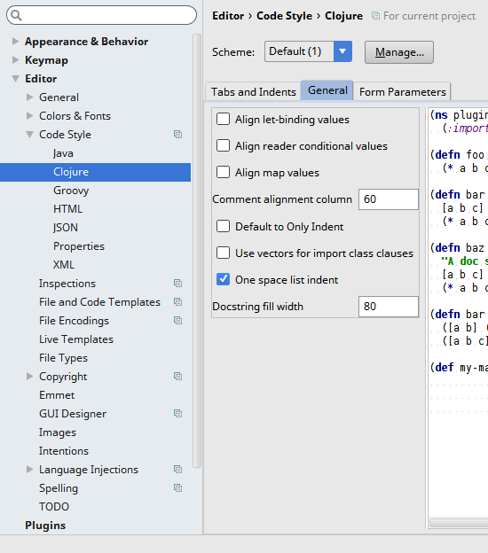

# pl-clojure-style

Centralized clojure style settings for puppetlabs projects

## Usage

This is meant to be used from source as a parent project using lein-parent.
Check this out next to the project you want to format. Merge into your
project.clj:

```clojure
  :profiles {:cljfmt {:plugins [[lein-cljfmt "0.3.0"]
                                [lein-parent "0.2.1"]]
                      :parent-project {:path "../pl-clojure-style/project.clj"
                                       :inherit [:cljfmt]}}}
  :aliases {"cljfmt" ["with-profile" "+cljfmt" "cljfmt"]}
```

Using a profile makes it possible to run normal lein commands without having
this repository present.

## Other style considerations

There are a few things that aren't automatically enforced by cljfmt.

### Line length

Not a hard rule, but try to keep it under 80 characters.

### Aligning values in maps and lets

Don't.

Good:
```clojure
{:key "some stuff"
 :another_much_longer_key "other stuff"}
```
Bad:
```clojure
{:key                     "some stuff"
 :another_much_longer_key "other stuff"}
```


## Editor specific settings

### Vim

Add the settings from [indents.vim](indents.vim) to your .vimrc.

### Emacs

Add the settings from [indents.el](indents.el) to your emacs
configuration.

### Cursive Clojure in IntelliJ

Cursive doesn't currently seem to have a way to add new rules for custom
indentation, but the built-in ones cover most of what we use (including
compojure, schema, test libraries, etc).

You should set the general indentation settings as shown:


